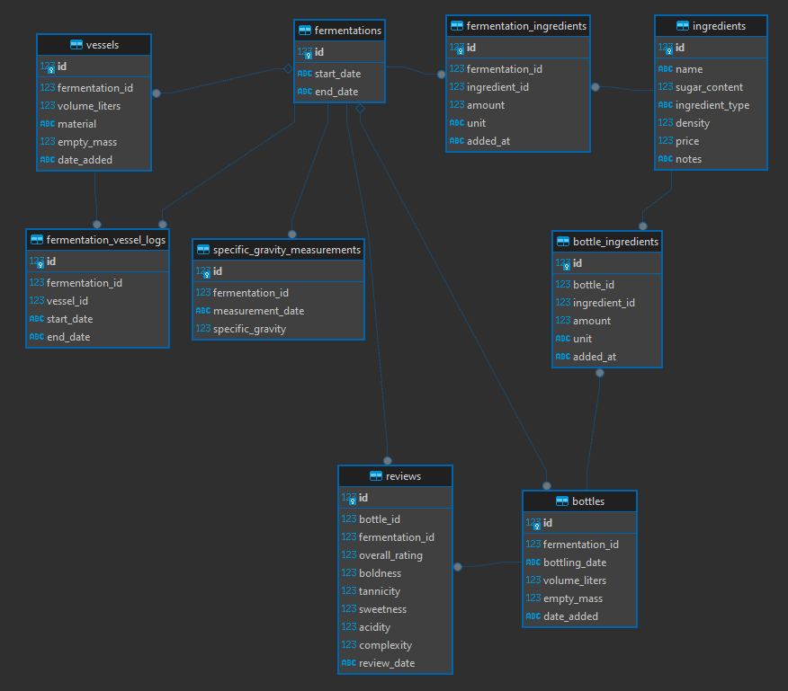

```
            _         ____          _
     /\    | |       / __ \        | |
    /  \   | |  ___ | |  | | _ __  | |_
   / /\ \  | | / __|| |  | || '_ \ | __|
  / ____ \ | || (__ | |__| || |_) || |_
 /_/    \_\|_| \___| \____/ | .__/  \__|
                            | |
                            |_|
```


[](https://github.com/thomashayama/AlcOpt/blob/Main/LICENSE)

Deployed to https://www.thomashayama.com/alcopt

A fermentation tracking and optimization web app. Log brews, track ingredients, record specific gravity and mass measurements, manage vessels and bottles, and review finished products with detailed tasting profiles.

## Features

- **Brew Logging** - Track fermentations with ingredients, vessels, SG/mass measurements, racking, and bottling
- **Tasting Reviews** - Rate bottles on overall quality, boldness, tannicity, sweetness, acidity, and complexity
- **Leaderboard & Analytics** - Rank fermentations by average rating, view correlation heatmaps and rating distributions
- **ABV & Sugar Calculations** - Predict potential ABV and residual sugar from ingredients and gravity readings
- **Vessel & Bottle Management** - Track carboys, demijohns, and individual bottles through the fermentation lifecycle
- **Google OAuth** - Authentication with role-based admin access

## Tech Stack

- **Streamlit** - Web UI
- **SQLAlchemy** + **SQLite** (or PostgreSQL) - Data layer
- **Matplotlib** / **Seaborn** / **Altair** - Visualization
- **Docker** - Containerized deployment
- **Google OAuth2** - Authentication

## Run

```bash
docker compose up -d app
```

### Development

```bash
# Windows
choco install make
make local

# Or directly
pip install -e .
streamlit run alcopt/app/main.py
```

## Install

### Option 1
```bash
pip install -e .
```

### Option 2
```bash
python -m pip install -r requirements.txt
```

## Configuration

Copy `.env.example` to `.env` and fill in:
- `DATABASE_URL` — database connection URI
- `GOOGLE_CLIENT_ID` / `GOOGLE_CLIENT_SECRET` — Google OAuth2 credentials
- `GOOGLE_REDIRECT_URI` — OAuth redirect URL
- `ADMIN_EMAILS` — comma-separated list of admin emails

## Deployment (Railway)

This repo is designed to be used as a **git submodule** in a deploy monorepo. On Railway:

1. Add this repo as a submodule in your deploy repo
2. Create a service in your Railway project and set the **Root Directory** to the submodule path
3. Add a **Postgres** service — Railway provides `DATABASE_URL` automatically
4. Set environment variables (or use Railway's env var UI):
   - `DATABASE_URL` — provided by Railway Postgres (auto-linked)
   - `GOOGLE_CLIENT_ID` / `GOOGLE_CLIENT_SECRET` — OAuth credentials
   - `GOOGLE_REDIRECT_URI` — OAuth redirect URL
   - `ADMIN_EMAILS` — comma-separated admin emails
   - `PORT` — set automatically by Railway

## Database

SQLite locally, PostgreSQL in production. The app auto-detects which to use based on the connection URI.

Using DBeaver (https://dbeaver.io) for SQL visualizations


